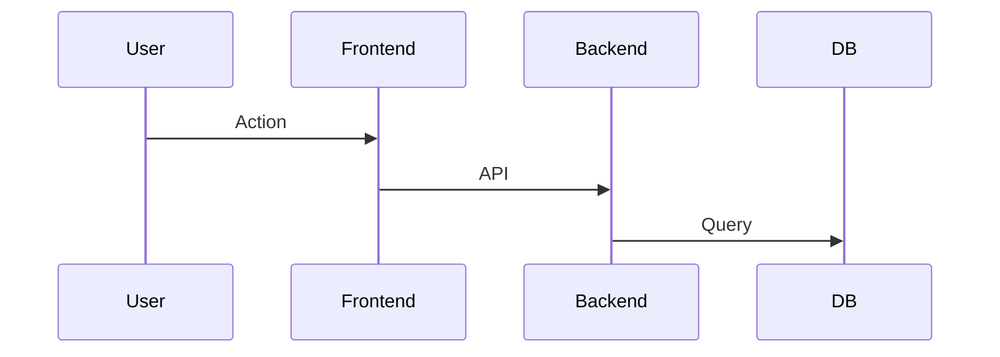

# OpenSpec Specifications

Process Flow をRequirementレベルに埋め込む：

```markdown
### Requirement: [Name]
[Description] (**MUST** / **SHOULD** / **MAY**)

#### Process Flow

```

#### Scenario: [Name]
- **WHEN** ...
- **THEN** ...
```
```
